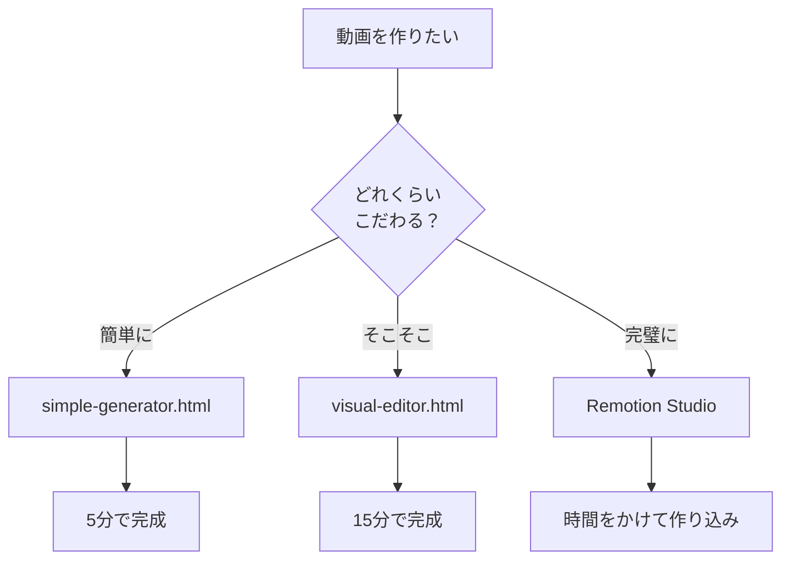

# 🎬 Remotionで透過歌詞動画を作る完全ガイド

#動画制作 #Remotion #歌詞オーバーレイ #FinalCutPro #自動化

## 📌 概要
RemotionとReactを使用して、Final Cut Pro用の透過背景歌詞オーバーレイ動画を自動生成するシステムを構築した。

---

## 🎯 このシステムでできること

- [ ] MP3と歌詞テキストから自動で動画生成
- [ ] 透過背景でFinal Cut Proに対応
- [ ] 何度でも再利用可能
- [ ] ブラウザで完全編集
- [ ] タイミングの自動計算

---

## 📁 プロジェクト構造

```
~/Developer/lyrics-overlay/
├── 📁 src/
│   ├── index.tsx                 # エントリーポイント
│   ├── Root.tsx                   # コンポジション定義
│   ├── 📁 compositions/
│   │   ├── LyricsOverlay.tsx     # 歌詞表示コンポーネント
│   │   └── LyricsWithAudio.tsx   # 音声付き版
│   ├── lyrics-data.json          # 歌詞とタイミングデータ
│   ├── simple-generator.html     # 簡単生成ツール
│   └── visual-editor.html        # ビジュアルエディタ
├── 📁 public/
│   └── audio.mp3                  # 音楽ファイル
├── 📁 scripts/
│   └── generate-lyrics.js        # 自動生成スクリプト
└── package.json
```

---

## 🚀 セットアップ手順

### 1. 初期セットアップ（初回のみ）

```bash
# プロジェクトフォルダへ移動
cd ~/Developer/lyrics-overlay

# 依存関係をインストール
npm install
```

### 2. Remotion Studioの起動

```bash
npm start
# → http://localhost:3000 が開く
```

---

## 🎨 3つの編集方法

### 方法1: Simple Generator（最も簡単）
[[simple-generator-guide]]

```bash
open src/simple-generator.html
```

**特徴：**
- ドラッグ&ドロップでMP3を読み込み
- 歌詞を一括入力
- 自動でタイミング計算

### 方法2: Visual Editor（中級者向け）
[[visual-editor-guide]]

```bash
open src/visual-editor.html
```

**特徴：**
- タイムライン表示
- リアルタイムプレビュー
- 細かいタイミング調整

### 方法3: Remotion Studio（プロ向け）
[[remotion-studio-guide]]

```bash
npm start
```

**特徴：**
- コード編集
- 完全なカスタマイズ
- プロ仕様の出力

---

## 📝 歌詞データの構造

```json
[
  {
    "startTime": 0,      // 開始時間（秒）
    "endTime": 3.5,      // 終了時間（秒）
    "text": "歌詞1行目"   // 表示するテキスト
  },
  {
    "startTime": 3.5,
    "endTime": 7,
    "text": "歌詞2行目"
  }
]
```

---

## 🎥 動画の生成コマンド

### 基本コマンド

```bash
# 透過背景で出力（Final Cut Pro用）
npm run build:transparent

# 音声付きで出力
npm run build:with-audio

# コマンドラインから歌詞生成
node scripts/generate-lyrics.js lyrics.txt 180
```

---

## 🎨 カスタマイズ設定

### 文字スタイルの変更
`src/compositions/LyricsOverlay.tsx`

```javascript
// 文字サイズ
fontSize: '60px'  // → '80px'で大きく

// 文字色
color: 'white'    // → 'yellow'で黄色に

// 位置
bottom: '150px'   // → '300px'で上に移動

// 背景透明度
backgroundColor: 'rgba(0, 0, 0, 0.7)'  // 0.7を変更
```

### アニメーション効果

```javascript
// スプリング設定
config: {
  damping: 30,      // 振動の減衰（小さい＝速い）
  stiffness: 150,   // バネの強さ（大きい＝速い）
  mass: 1,          // 質量
}

// スライドイン
translateY: [50, 0]  // [開始位置, 終了位置]
```

---

## 🔧 トラブルシューティング

### よくある問題と解決方法

| 問題 | 原因 | 解決方法 |
|------|------|----------|
| npm: command not found | Node.js未インストール | https://nodejs.org からインストール |
| 歌詞が表示されない | JSONファイルの配置ミス | `src/lyrics-data.json`を確認 |
| 音が出ない | MP3ファイルがない | `public/audio.mp3`を配置 |
| タイミングがずれる | フレームレート不一致 | fps設定を確認（30fps） |

---

## 💡 Tips & Tricks

### 効率化のコツ

1. **テンプレート化**
   - よく使うスタイルを保存
   - 複数プロジェクトで使い回し

2. **バッチ処理**
   ```bash
   # 複数の曲を一括処理
   for song in *.mp3; do
     npm run build:transparent
   done
   ```

3. **バージョン管理**
   ```bash
   git init
   git add .
   git commit -m "Initial setup"
   ```

---

## 📊 技術スタック

- **Remotion**: 動画生成フレームワーク
- **React**: UIコンポーネント
- **TypeScript**: 型安全な開発
- **ProRes 4444**: 透過対応動画コーデック

---

## 🔗 関連リンク

- [Remotion公式ドキュメント](https://www.remotion.dev/)
- [React公式](https://react.dev/)
- [Final Cut Pro](https://www.apple.com/final-cut-pro/)

---

## 📈 今後の拡張アイデア

- [ ] カラオケ風ハイライト表示
- [ ] 複数言語対応
- [ ] 自動文字起こし連携
- [ ] AIによる歌詞タイミング最適化
- [ ] YouTube字幕ファイル出力

---

## 🏷️ タグ

#動画制作 #Remotion #React #TypeScript #FinalCutPro #透過動画 #歌詞オーバーレイ #自動化 #プログラミング

---

## 📅 更新履歴

- 2024-08-26: 初版作成
- プロジェクトをDeveloperフォルダに移動
- iCloud同期対策を実装
- 3つの編集ツールを作成

---

## 📌 重要なパス

```bash
# プロジェクトルート
~/Developer/lyrics-overlay/

# 歌詞データ
~/Developer/lyrics-overlay/src/lyrics-data.json

# 音楽ファイル
~/Developer/lyrics-overlay/public/audio.mp3

# 出力先
~/Developer/lyrics-overlay/out/
```

---

## ✅ チェックリスト（毎回の作業）

- [ ] MP3ファイルを準備
- [ ] 歌詞テキストを準備
- [ ] `cd ~/Developer/lyrics-overlay`
- [ ] 編集ツールを選択（simple/visual/studio）
- [ ] lyrics-data.jsonを生成/編集
- [ ] public/audio.mp3を配置
- [ ] `npm run build:with-audio`
- [ ] Final Cut Proにインポート

---

## 🎯 使い分けガイド



---

## 📝 メモ

- Remotion StudioはReactの知識があると使いやすい
- 透過動画はProRes 4444形式が必須
- node_modulesはiCloud同期から除外すること
- フレームレートは30fpsで統一

---

この内容を自由にカスタマイズして使ってください！r